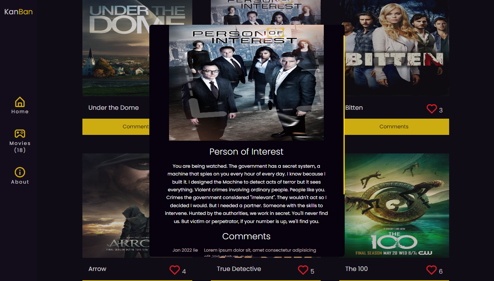
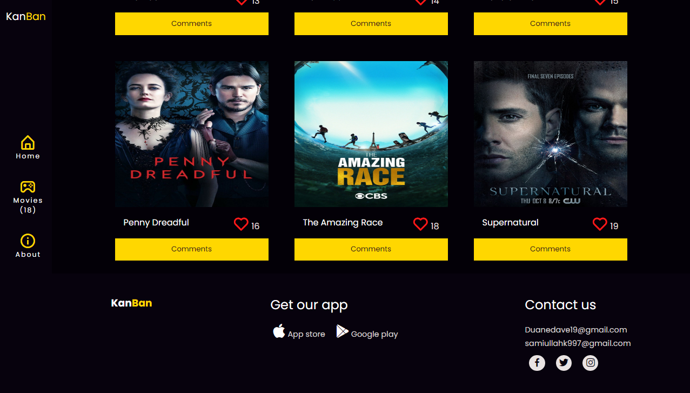

# Capstone-Kanban

This app is built with HTML | CSS | JAVASCRIPT | WEBPACK and JEST it uses multiple API to render popular movies and enable users to have social interactivity such as like and comments

## Built With

- HTML.
- Javascript.
- Css.
- Webpack.
- Webpack-dev server.

## To get a local copy up and running follow these simple example steps.

- Clone this repo to your machine by using Git clone: Git clone `https://github.com/DuaneDave/LeaderBoard`
- open in your vs code terminal and run live server
- `npm install -g @lhci/cli@0.7.x`
- `npm install --save-dev hint@6.x`
- `npm install --save-dev stylelint@13.x stylelint-scss@3.x stylelint-config-standard@21.x stylelint-csstree-validator@1.x`

### Run the following tests:

To run tests on this project if you tweaked something, run the following command

- `npx hint .`
- `npx stylelint "\*_/_.{css,scss}"`
- `npx eslint .`
- Install jest using `npm i --save-dev jest`
- Install jsDom using `npm install --save-dev jest-environment-jsdom-global jest-environment-jsdom`
- run your test using `npm run test`

### LIVE DEMO

Check the live demo here [LINK](https://drive.google.com/file/d/1G-RGNSiVVRTFyf1Krznls79v-Op5yvAn/view?usp=sharing)
Check the live version [here](https://duanedave.github.io/Capstone-Kanban/)

## Authors

👤 **Obiebi Okiemute David**

- GitHub: [@githubhandle](https://github.com/DuaneDave)
- Twitter: [@twitterhandle](https://twitter.com/dave_duane)
- LinkedIn: [LinkedIn](https://www.linkedin.com/in/okiemute-david-obiebi-6b4a6a230/)

👤 **Sami Ullah**

- GitHub: [@githubhandle](https://github.com/samiullah997)
- Twitter: [@twitterhandle](https://twitter.com/samiullahk997)
- LinkedIn: [LinkedIn](https://www.linkedin.com/in/samiullah-khan-2702b7171/)

## 🤝 Contributing

Contributions, issues, and feature requests are welcome!

Feel free to check the [issues page](https://github.com/DuaneDave/Capstone-Kanban/issues).

## Show your support

Give a ⭐️ if you like this project!

## Acknowledgments

- Hat tip to anyone whose code was used
- Inspiration
- etc

## 📝 License

This project is licensed by [MIT](./LICENSE).
